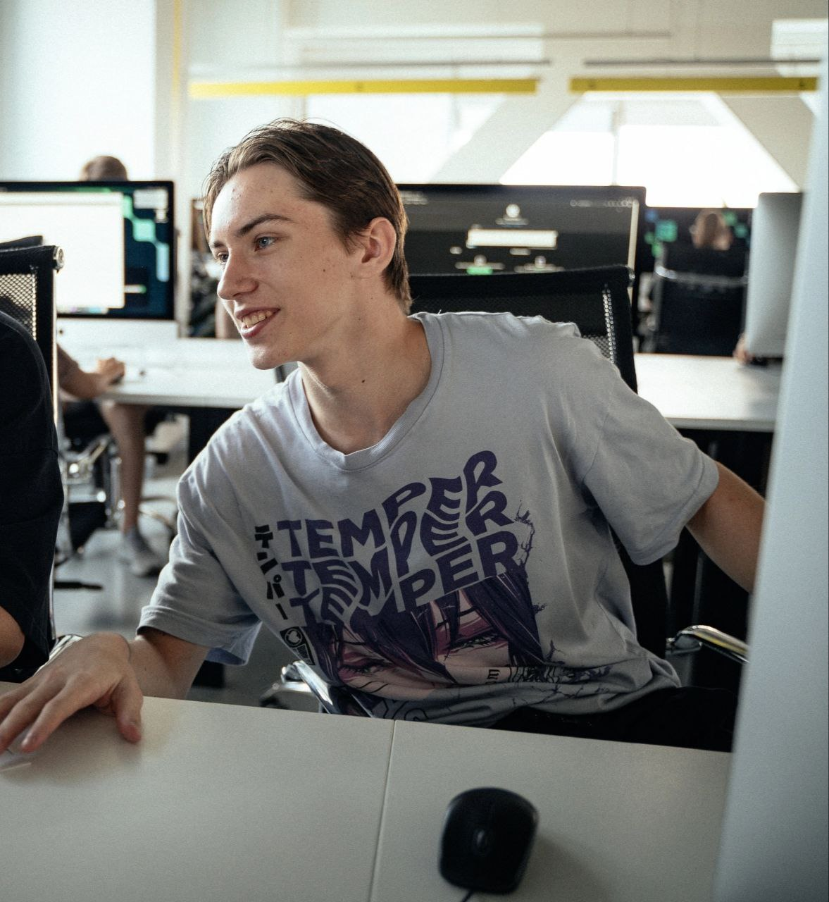

<h1 align="center">Привет, я Даниил 👋</h1>

  

  ⚙️ Backend-разработчик на Go 
  Микросервисы • Архитектура • AI-интеграции • Надёжный продакшн

---

### 🧠 Немного обо мне

- 🔧 Пишу на **Go**, строю backend-сервисы с нуля
- 🧩 Проектирую **микросервисы** с gRPC, Kafka, Redis, PostgreSQL
- 🔐 Внедряю авторизацию, мониторинг, логирование
- ❤️ Увлечён архитектурой, читаемым кодом и системным подходом

---

### 💼 Чем я могу быть полезен

- Создать продуманный backend с нуля
- Разделить монолит на микросервисы
- Настроить взаимодействие сервисов через Kafka/gRPC
- Подключить авторизацию, базы данных, кеш и мониторинг
- Оптимизировать производительность и ресурсы

---

### 🧰 Технологии, с которыми я работаю

---

### 📌 Проекты

#### 🧠 [J.A.R.V.I.S. — голосовой ассистент](https://github.com/Deadrafa/J.A.R.V.I.S.)
> Ассистент на Go с голосовым вводом, AI-интеграцией и календарным микросервисом  
> 🛠️ GigaChat · REST · Docker · Makefile

#### 📅 [J.A.R.V.I.S-calendarService](https://github.com/Deadrafa/J.A.R.V.I.S-calendarService)
> Микросервис событий с REST/gRPC API, авторизацией и PostgreSQL  

---

### 🧠 Leetcode

---

### 📫 Контакты

- 📬 Email: [daniil_moskvin_05@mail.ru](mailto:daniil_moskvin_05@mail.ru)  
- 💬 Telegram: [@daniil_num_1](https://t.me/daniil_num_1)  

---

Спасибо, что заглянул! Хорошего дня 👋

